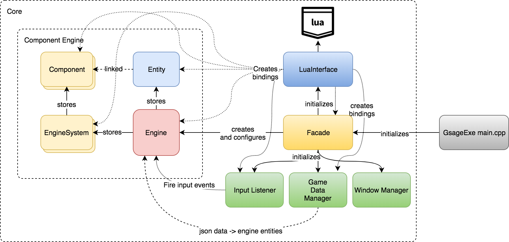

Internals
===========

Terminology
^^^^^^^^^^^

* **component** — building block for the :cpp:class:`Gsage::Entity`. Constructing :code:`Entity` from different components will make it have different features.
* **system** — part of the :cpp:class:`Gsage::Engine`. Implements some gaming logic, manages corresponding **component** pool.
* **manager** — logic, that goes out of **system** boundary, is wrapped into a **manager**. For example: UI, Input, Windowing.
