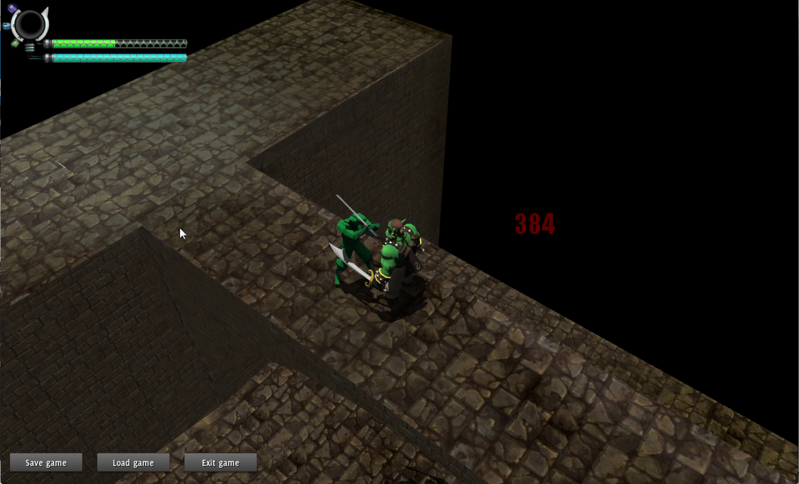
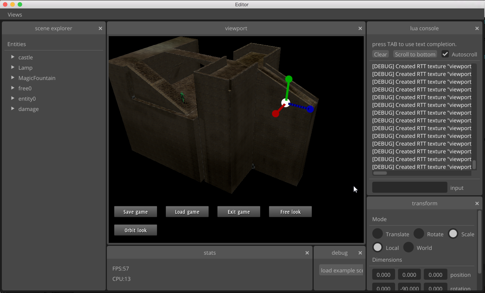

Introduction
============

This tutorial will teach you to create some basic scene using Gsage engine.

If you haven't built engine yet, check out these build tutorials:

| :ref:`linux-build`
| :ref:`mac-build`
| :ref:`windows-build`
|

If you've managed to get engine built, then you should have the following:

* :code:`GsageExe`/:code:`GsageExe.app`/:code:`GsageExe.exe` executable file should be
  in the **<your-cmake-build-folder>/bin** folder. This file is the main game executable.

* All resources are located in **./resources** folder. They are symlinked to **GsageExe.app/Contents/Resources**
  on the Mac OS X systems.

* :code:`editor`/:code:`editor.app`/:code:`editor.exe` should also be in the game folder.

By running :code:`GsageExe` executable, you can start the engine, which is configured in isometric rpg mode by default.

This will change in the future, when the **editor** project will become mature enough. Now the only
useful thing it can do is to create a project:

Modifying Level
---------------

Now you can open resources folder and find **levels** folder there.

There should be file named **exampleLevel.json**. This file is a basic level example, you can change it in any way.

For example:

1. Add some model to **resources/models** folder (:code:`world.mesh`).
2. Change entities list, and add this model to position :code:`"x: 0, y: 0, z:0"`:

.. code-block:: javascript

  entities: [
  ...
  {
    "id": "hello",
    "render": {
      "root": {
        "position": "0,0,0",
        "rotation": "1,0,-1,0",
        "scale": "1,1,1",
        "children": [{
          "type": "model",
          "mesh": "world.mesh",
          "castShadows": true
        }]
      }
    }
  }
  ...

When you run the **GsageExe** again, you should see the model on the scene.
Also if it's placed close enough to the existing walkable area, you will be able to walk on it.

For more information about entities format see :ref:`entity-format-label`.

Modifying level demo:

.. raw:: html

  <iframe width="640" height="360" src="http://www.youtube.com/embed/ZcrrwkIluyM?feature=player_detailpage" frameborder="0" allowfullscreen="1">&amp;nbsp;</iframe>

Creating Characters
-------------------

It's also possible to create dynamic level characters.
All characters can be found in characters folder.

There should be 2 characters in that folder:

* **sinbad.json** which is controlled by player.
* **ninja.json** which are hostile NPC.

You can create another one.

1. Grab model with some animations and add it to models folder.
2. Create new :code:`json` file in the **resources/characters** folder.
3. Now you should be able to configure the character:

   3.1. Write Render Component

   .. code-block:: javascript

      "render":
      {
        "resources":
        {
          "Mob":
          [
            "Zip:models/packs/mob.zip" // pack file
            // or you can do
            "FileSystem:models/mob/"
            // or you can omit this section and add resource folder in global settings
          ]
        },
        "root":
        {
          "scale":"1,1,1",
          "rotation":"1,0,1,0",
          "children":
          [
            {
              "type": "model",
              // this is important, otherwise this entity will be treated as part of level
              "query": "dynamic",
              "name": "modelName",
              "mesh": "mob.mesh",
              "castShadows": true
            }
          ]
        },
        "animations":
        {
          "states":
          {
            // animation is configured as <model_name>.<animation_name>
            "walk": {"body": "modelName.WalkAnimation"},
            "idle": {"body": "modelName.IdleAnimation"},
            "attack": {"top": "modelName.AttackAnimation"},
          },
          "defaultState": "idle",
          // animation speed. Adjust if necessary
          "defaultSpeed": 1
        }
      }

   3.2. Write Movement Component

   .. code-block:: javascript

      "movement":
      {
        // movement speed
        "speed": 10,
        // animation to use for movement
        "moveAnimation": "walk",
        // animation/speed ratio to apply
        "animSpeedRatio": 0.15
      },

   3.3. Write Combat Component

   .. code-block:: javascript

      // combat component is not limited by param types at all
      "combat": {
        "anything": 123
      }

   3.4. Write Script Component

   Create script file **characters/scripts/mob.lua**.
   This file will be used as a setup script.

   It is better to return function in startup script.
   This function should accept :code:`self` parameter.

   .. code-block:: lua

      -- log information on startup
      return function(self) print("I am alive! (" .. self.id .. ")") end

   Then write behaviour:

   .. code-block:: lua

      local function moveRandomly(self, context)
        local position = Vector3:new(
          self:render().position.x + math.random(30) - 15,
          0,
          self:render().position.z + math.random(30) - 15
        )
        self:movement():go(position)
      end

      local function createTree()
        return Repeat(
            Delay(Leaf(moveRandomly), function() return math.random(700)/100 + 3 end)
          )
        )
      end

      btree.register("walker", createTree)

   Saving it as **behaviours/trees/walker.lua**.

   Then you will be able to define script component:

   .. code-block:: javascript

      "script":
      {
         "setupScript": "@File:characters/scripts/mob.lua",
         "behavior": "walker"
      }

4. Add character to scene. Edit **scripts/start.lua** file, add:

   .. code-block:: lua

      entity.create("mob")

   This will create NPC.
   Or you can use lua console in GsageExe.

   Console can be invoked by :code:`F9` key.
   Type the same line there, and NPC will appear.

Modifying UI
------------

UI integration is managed by classes, derived from :cpp:class:`Gsage::UIManager` interface.
Engine can have several UI libraries running at the same time.

LibRocket
^^^^^^^^^

:code:`RocketUI` plugIn should be installed.

LibRocket looks like a dead project, but it can be configured
very nicely using rml and rcss files.

And also it supports lua bindings out of the box, so can have very organic
connection with other parts of the engine.

All librocket ui files are stored in the :code:`resources/ui` folder.
Currently it's in the mess, but it will be cleaned up very soon.

Imgui
^^^^^

:code:`ImGUI` plugIn should be installed.

Imgui views can be registered in lua using:

   .. code-block:: lua

      -- render method
      function render()
      imgui.ShowTestDialog()
      end

      -- render view class for stateful UI
      View = class(function()
      end)

      function view:__call()
      imgui.ShowTestDialog()
      end

      local view = View()

      imgui.render:addView("viewID", view)
      imgui.render:addView("viewID2", render)

      -- remove
      success = imgui.render:removeView("viewID")
