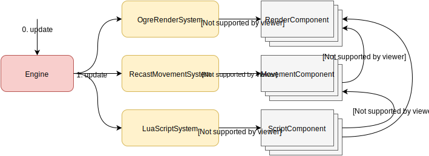
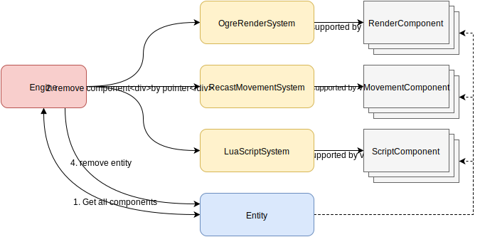

Entity
======

.. _entity-format-label:

Entity Format
-------------

Each entity consists of several components.

Each component can communicate with adjacent component through entity.
Each component belongs to one system and stores state of the
entity for that system.

For example, for render system:

.. code-block:: javascript

    "render": {
      "root": {
        "position": "0,0,0",
        "rotation": "1,0,-1,0",
        "scale": "1,1,1",
        "children": [{
          "type": "model",
          "mesh": "castle.mesh",
          "name": "castle",
          "castShadows": true
        }]
      }
    }

The component stores information about nodes: :code:`"root"` is always root node of the component.
It has :code:`"position"`, :code:`"rotation"` and other props, typical for render system.
:code:`"children"` here can store the list of various visual children:

* models.
* billboards.
* particle systems.
* and others.

There are different kinds of systems.
Script component data can look like this:

.. code-block:: javascript

  "script":
  {
    "setupScript": "@File:characters/scripts/ninja.lua",
    "behavior": "dumbMonster"
  }

The engine is highly extensible, so it's easy to add any new kind of system.
Each system is installed in the engine with the unique string id. The same id is used
to match the system where the entity should be created.

That way, engine will find system by the name :code:`"script"` and will create new component there using
parameters, which are defined for it in the entity description.

For example for the **script** component type it will call
:cpp:func:`Gsage::Engine::createComponent` with :code:`type = "script"` and dict:

.. code-block:: javascript

  {
    "setupScript": "@File:characters/scripts/ninja.lua",
    "behavior": "dumbMonster"
  }

Then it will add the pointer to the created component to the entity object.

Lifecycle
---------

On each update, each component state can be updated.
Engine iterates and updates all the systems and each system iterates and updates each component it owns.

Each component can be altered during engine operation.
For example, render component can update it's position or change model.
Movement can change speed.

Entity Add Flow
---------------

1. :cpp:class:`Gsage::Engine` creates :cpp:class:`Gsage::Entity` in the pool of entities.
   All entities are stored in the :cpp:class:`Gsage::Engine`.
2. Engine iterates through the list of keys of :cpp:class:`Gsage::Entity`,
   finds appropriate system by string :code:`id` and allocates a component there.
3. Each system allocates the component in the pool and configures created component
   with :cpp:class:`Gsage::DataProxy` that came from :cpp:class:`Gsage::Engine`.

Entity Remove Flow
------------------

1. :cpp:class:`Gsage::Engine` finds :cpp:class:`Gsage::Entity` by id and 
   iterates through all it's components.
2. :cpp:class:`Gsage::Engine` removes each component by pointer it got from 
   :cpp:class:`Gsage::Entity`.
3. :cpp:class:`Gsage::ComponentStorage` deallocates component.
4. :cpp:class:`Gsage::Engine` removes entity from pool when all components are deleted.

